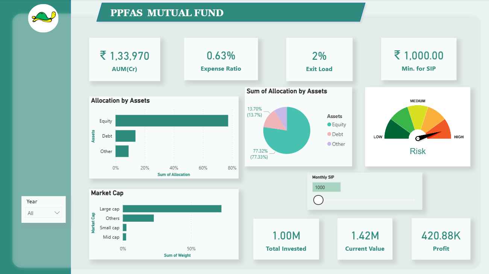
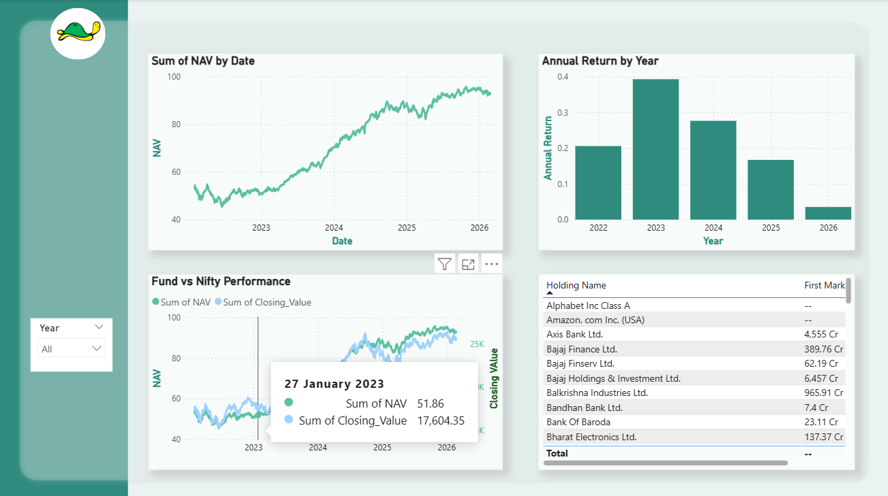

# 📊 Parag Parikh Flexi Cap Fund – Power BI Dashboard

## 📌 Project Overview

This project presents a **Power BI dashboard analyzing the Parag Parikh Flexi Cap Fund**.
The dashboard provides insights into **fund fundamentals, portfolio allocation, and performance trends**.

It demonstrates how **data analytics and visualization can help investors understand fund performance and portfolio structure**.

---

# 🖥️ Dashboard Preview



---

# 📊 Dashboard Sections

## 1️⃣ Fundamentals

The **Fundamentals page** provides a high-level overview of the mutual fund.

### Key Metrics

* Assets Under Management (AUM)
* Expense Ratio
* Exit Load
* Minimum SIP Investment

### Portfolio Overview

* Asset Allocation (Equity / Debt / Other)
* Market Capitalization Distribution
* Risk Indicator
* SIP Investment Simulator

### Investment Outcome

* Total Invested
* Current Portfolio Value
* Profit Generated

---

## 2️⃣ Performance Analysis

The **Performance page** evaluates the fund's historical performance.

### Key Visualizations

* NAV Growth Trend
* Fund vs Nifty Benchmark Comparison
* Annual Return Analysis
* Portfolio Holdings Table

These visuals help evaluate **how the fund performs relative to the market benchmark**.

---

# 🛠 Tools & Technologies Used

* **Power BI**
* **Microsoft Excel**
* **DAX (Data Analysis Expressions)**
* Financial Market Data

---

# 📂 Dataset

The dataset used in this project includes:

* Historical **NAV (Net Asset Value)** data
* **Benchmark data (Nifty 50 index)**
* **Portfolio holdings**
* **Sector allocation**
* **Market capitalization categories**

Data was cleaned and prepared before building the dashboard.

---

# 📁 Project Structure

```
Parag-Parikh-Dashboard---BI
│
├── dashboard.pbix
├── dataset.xlsx
├── screenshot.png
└── README.md
```

---

# 🔍 Key Insights

* The fund shows **steady long-term NAV growth**.
* Portfolio allocation is dominated by **large-cap stocks**.
* Financial and service sectors have significant exposure.
* SIP simulation demonstrates **consistent long-term wealth creation**.

---

# 👨‍💻 Author

**Sidharth**

Data Analytics | Power BI | Financial Analysis

GitHub Profile:
https://github.com/sidharth7987

---

⭐ If you like this project, consider **starring the repository**.
